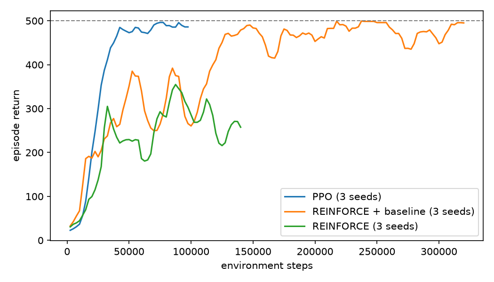

<div align="center">


</div>

<div align="center">


[](LICENSE)
[](https://github.com/Momoyeyu/small-language-model/commits/master)


</div>

<div align="center">
  <h3>"Understand one line of math, run one line of code"</h3>
</div>

<div align="center">

[中文](./README.md) | English

</div>

* To be clear up front: there is **no** model called small-language-model here. "Small" means taking the core techniques of large language models and cutting them **small** — small enough that a file can be read in one go, a script can be run end to end, and a claim can be verified by a single test.
* Each module covers one LLM technique, implemented from scratch in plain **PyTorch**, without the high-level wrappers of Gym, TRL, Transformers, or similar frameworks.
* Each module ships with a long-form article (in Chinese) whose formulas and variable names map one-to-one onto the code: every section has a runnable script, every claim has a test.
* Everything runs on CPU, and most experiments finish in minutes on an ordinary laptop.
* The first module is **PPO**: from MDPs all the way to RLHF. More modules will follow the [LLM article series](https://momoyeyu.github.io/archive/?category=LLM).

> [!NOTE]
> This project is built for **learning**, not performance: clarity comes first. To train real large models, use engineered frameworks such as TRL, OpenRLHF, verl, or Megatron.

---

# 📌 Introduction

A modern LLM is a long stack of techniques: Transformers, MoE, normalization, positional encoding, RLHF… each with a full derivation behind it. Off-the-shelf frameworks, meanwhile, expose a handful of highly abstracted calls — one `trainer.train()` and an alignment run is done. Convenient, but it also keeps learners away from the actual algorithms.

small-language-model does one simple thing: **pick a technique, walk its derivation chain, and at every step turn the formula into code you can run and verify**. After finishing a module you should be able to write that technique from scratch yourself and know exactly which term of the formula each line implements.

#### 🎉 Released modules

| Module | Companion article | Contents | Released |
| --- | --- | --- | --- |
| [PPO](#-ppo-module) | [从零理解 PPO](https://momoyeyu.github.io/posts/llm-ppo/) | MDP → value functions → policy gradient → Actor-Critic → trust region → PPO → RLHF | 2026-10 |

# 📌 Quick Start

My verification environment (for reference)

* GPU: NVIDIA GeForce RTX 4080 SUPER (32GB) × 2
* OS: Ubuntu 24.04
* Python==3.12
* PyTorch==2.x

## Step 0

```bash
# Clone
git clone https://github.com/Momoyeyu/small-language-model
cd small-language-model

# Option 1: uv (recommended)
uv venv --python 3.12 && source .venv/bin/activate
uv pip install -r requirements.txt

# Option 2: pip
pip install -r requirements.txt

# In mainland China, add a mirror: --index-url https://mirrors.aliyun.com/pypi/simple
```

```bash
# Run all fast tests to confirm the environment works (~30 s on CPU)
pytest
```

# 📌 PPO Module

RLHF is what taught ChatGPT to talk like a helpful assistant, and the optimizer behind RLHF is PPO. Yet the PPO objective is a single line sitting on top of a whole stack of RL concepts: policies, returns, value functions, advantages, policy gradients, importance sampling, trust regions… Jump straight to PPO and you will likely remember the `clip` without understanding why it looks the way it does. This module takes PPO as its destination and walks the whole derivation chain from zero.

* Hand-written CartPole (physics identical to Gymnasium CartPole-v1) and random-walk environments.
* Bellman policy evaluation and Monte Carlo estimation, checked against the closed-form values.
* Full REINFORCE training (with / without baseline) that makes the effect of a baseline on variance obvious.
* GAE (Generalized Advantage Estimation), with both the λ=0 and λ=1 limits verified.
* Complete PPO: clipped objective, value loss, entropy bonus, advantage normalization, orthogonal init, learning-rate annealing, gradient clipping.
* Toy RLHF: a tiny GRU language model + per-token KL penalty + sequence-level reward + GAE + PPO, compared against the closed-form optimum of KL-regularized RL.

> The CartPole networks are tiny and data shuttles between CPU and GPU at every environment step, so **`--device cpu` is often faster than a GPU**; the RLHF part uses larger batches and benefits somewhat from a GPU.

## Ⅰ 📖 Follow the derivation chain

Each script maps to one section of the article and finishes in seconds:

```bash
python scripts/ppo/01_mdp.py                 # sample trajectories, compute discounted returns backwards
python scripts/ppo/02_value.py               # Bellman equation vs. Monte Carlo, advantage function
python scripts/ppo/03_baseline.py            # a baseline keeps the gradient unbiased but cuts variance
python scripts/ppo/04_gae.py                 # the λ=0 / λ=1 limits of GAE
python scripts/ppo/05_importance_sampling.py # importance sampling: unbiased, but variance grows with distance
python scripts/ppo/06_ppo_clip.py            # clipping blocks over-optimism, never error correction
```

## Ⅱ 🛠️ Training

### 1' Policy gradient: REINFORCE

```bash
python trainer/train_reinforce.py --device cpu                # with baseline
python trainer/train_reinforce.py --device cpu --no_baseline  # vanilla REINFORCE
```

> Training writes the weights `reinforce_baseline_seed0.pth` and the training log `reinforce_baseline_seed0.json` to `./out/`

### 2' PPO

```bash
python trainer/train_ppo.py --device cpu
```

Each update prints the average return, the clip fraction `clip_frac`, and the approximate KL `approx_kl`:

```text
update  31/48 | steps  63488 | avg return (last 10)  464.7 | clip_frac 0.000 | approx_kl 0.0011
update  32/48 | steps  65536 | avg return (last 10)  500.0 | clip_frac 0.016 | approx_kl 0.0031
```

### 3' Toy RLHF

```bash
python trainer/train_rlhf.py --beta 0.1   # with KL penalty
python trainer/train_rlhf.py --beta 0     # without KL penalty — watch the policy collapse
```

At the end of training the closed-form optimum of KL-regularized RL is printed alongside for comparison.

### 4' Evaluation and plots

```bash
python eval_cartpole.py --weight ppo_seed0 --greedy   # evaluate a trained CartPole policy
python scripts/ppo/plot_curves.py                     # plot learning curves from ./out
```

Use `--seed` to switch random seeds; curves from several seeds are far more representative.

## Ⅲ ✅ Tests

```bash
pytest tests/test_ppo.py                                  # fast tests, ~30 s on CPU
SLM_SLOW=1 pytest tests/test_ppo.py                       # include full training runs
SLM_SLOW=1 SLM_DEVICE=cuda pytest tests/test_ppo.py       # choose the device
```

## Ⅳ �️ Code map

| Step | Article section | Code |
| --- | --- | --- |
| MDP | 马尔可夫决策过程 | [envs/cartpole.py](envs/cartpole.py), `discounted_returns` / `rollout` in [utils/rl_utils.py](utils/rl_utils.py), [01_mdp.py](scripts/ppo/01_mdp.py) |
| Value functions | 价值函数 | [envs/random_walk.py](envs/random_walk.py), [02_value.py](scripts/ppo/02_value.py) |
| Policy gradient | 策略梯度 | `Policy` in [model/model_rl.py](model/model_rl.py), [03_baseline.py](scripts/ppo/03_baseline.py), [train_reinforce.py](trainer/train_reinforce.py) |
| Actor-Critic | Actor-Critic | `compute_gae` in [utils/rl_utils.py](utils/rl_utils.py), [04_gae.py](scripts/ppo/04_gae.py) |
| Trust region | 信任域 | `importance_sampling` in [utils/rl_utils.py](utils/rl_utils.py), [05_importance_sampling.py](scripts/ppo/05_importance_sampling.py) |
| PPO | PPO | `ActorCritic` in [model/model_rl.py](model/model_rl.py), [06_ppo_clip.py](scripts/ppo/06_ppo_clip.py), [train_ppo.py](trainer/train_ppo.py) |
| RLHF | PPO 与 RLHF | [model/model_lm.py](model/model_lm.py), [train_rlhf.py](trainer/train_rlhf.py) |

<details>
<summary><b>The heart of PPO: the clipped objective</b></summary>

$$
L^{\text{CLIP}}(\theta)
=
\mathbb{E}_t
\left[
\min\left(
\rho_t(\theta) \hat{A}_t,\;
\operatorname{clip}\left(\rho_t(\theta), 1 - \epsilon, 1 + \epsilon\right) \hat{A}_t
\right)
\right],
\quad
\rho_t(\theta) = \frac{\pi_\theta(a_t \mid s_t)}{\pi_{\theta_{\text{old}}}(a_t \mid s_t)}
$$



With a positive advantage, the gradient vanishes once the ratio exceeds $1+\epsilon$; with a negative advantage, once it drops below $1-\epsilon$. Outside the shaded regions the gradient is intact and pulls a policy that went the wrong way back.

</details>

<details>
<summary><b>The four models of RLHF</b></summary>



In the toy RLHF, the Actor and Critic share one GRU backbone, the reward model is replaced by a rule (the fraction of token `3`), and the reference model is a frozen copy of the initial policy.

</details>

## Ⅴ � Results

All results below were produced in the verification environment above by following the Quick Start steps. CartPole runs use `--device cpu`; the toy RLHF uses `--device cuda`.

**CartPole** (3 random seeds: 0 / 1 / 2)

| Algorithm | Budget | Average return at the end | First 10-episode average ≥ 475 | Time per seed |
| --- | --- | --- | --- | --- |
| REINFORCE | 1000 episodes (140k–190k steps) | 120 / 191 / 137 | never | ~45 s |
| REINFORCE + baseline | 1000 episodes (320k–330k steps) | 484 / 463 / 492 | — | ~90 s |
| PPO | 100k steps | 448 / 500 / 500 | 29k / 37k / 40k steps | ~100 s |

> REINFORCE averages the last 100 episodes; PPO averages the last 10.

Evaluated with `eval_cartpole.py --greedy`, all three trained PPO policies balance the pole for the full 500 steps in every one of 20 episodes.



**Toy RLHF** (average of the last 10 iterations)

| KL coefficient β | Score | Sequence KL | Theory |
| --- | --- | --- | --- |
| 0 | 1.000 | 16.75 | collapse: score 1, KL → 8 log 8 ≈ 16.64 |
| 0.1 | 0.332 | 1.11 | closed form π* ∝ π_ref · exp(r / β): score 0.333, KL 1.159 |

Without a KL penalty the policy collapses to emitting only token `3` — reward hacking in miniature. With the penalty, the policy PPO converges to closely matches the closed-form optimum of KL-regularized RL.

**Tests**: all 12 fast tests pass (~30 s on CPU); all 16 tests including full training pass under `SLM_SLOW=1 SLM_DEVICE=cuda` (~27 min).

# 📌 Project Layout

```text
small-language-model
├── envs/              # hand-written environments: CartPole, random walk
├── model/             # networks: Policy, ActorCritic, TinyLM
├── utils/             # discounted returns, rollout, GAE, importance sampling, seed & device
├── trainer/           # training scripts: REINFORCE, PPO, toy RLHF
├── scripts/
│   └── ppo/           # PPO module: numbered demos along the derivation chain + curve plotting
├── tests/             # one test file per module, one test per claim
├── eval_cartpole.py   # evaluate a trained CartPole policy
└── images/
```

# 📌 References

* [从零理解 PPO](https://momoyeyu.github.io/posts/llm-ppo/) (companion article of the PPO module, in Chinese)
* [Reinforcement Learning: An Introduction](http://incompleteideas.net/book/the-book-2nd.html)
* [OpenAI Spinning Up in Deep RL](https://spinningup.openai.com/)
* [High-Dimensional Continuous Control Using Generalized Advantage Estimation](https://arxiv.org/abs/1506.02438)
* [Trust Region Policy Optimization](https://arxiv.org/abs/1502.05477)
* [Proximal Policy Optimization Algorithms](https://arxiv.org/abs/1707.06347)
* [The 37 Implementation Details of Proximal Policy Optimization](https://iclr-blog-track.github.io/2022/03/25/ppo-implementation-details/)
* [Training Language Models to Follow Instructions with Human Feedback](https://arxiv.org/abs/2203.02155)
* [MiniMind](https://github.com/jingyaogong/minimind): the layout and README style of this repository are inspired by it

# 📌 License

This repository is licensed under the [Apache-2.0 License](LICENSE).
